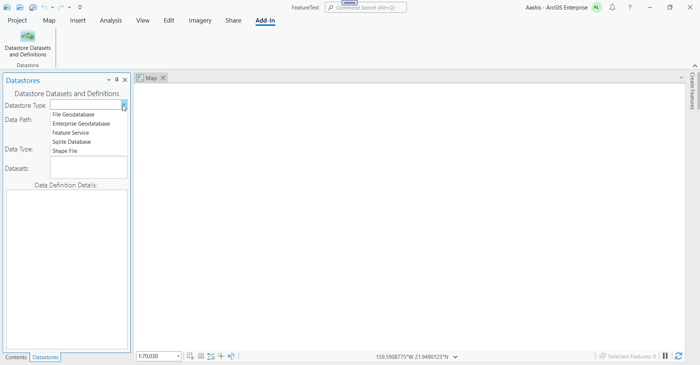
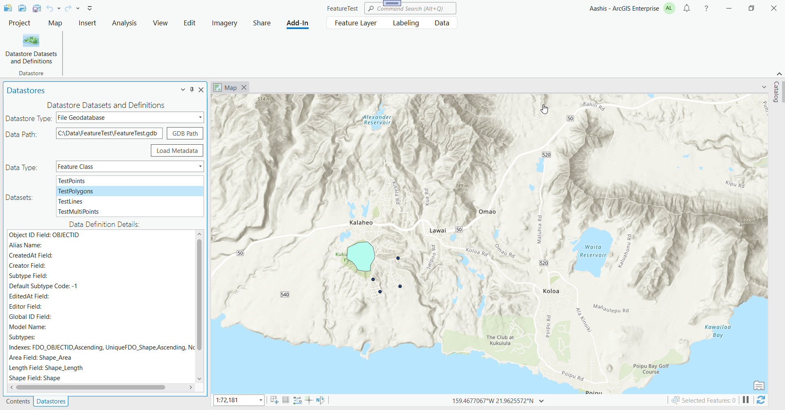
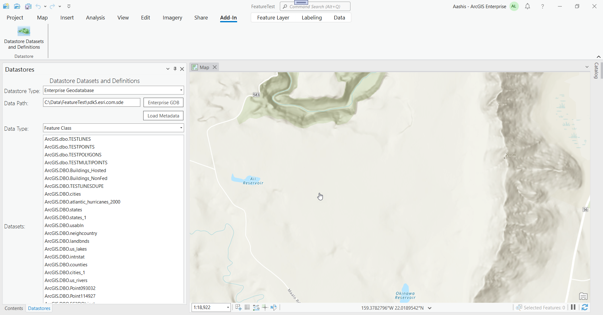
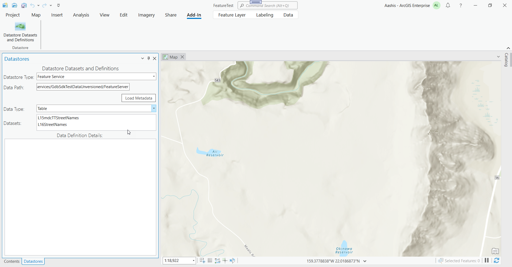

## DatastoresDefinitionsAndDatasets

<!-- TODO: Write a brief abstract explaining this sample -->
This sample illustrates the use of Datastore, Definitions, and Datasets of the Geodatabase API.  
  


<a href="https://pro.arcgis.com/en/pro-app/sdk/" target="_blank">View it live</a>

<!-- TODO: Fill this section below with metadata about this sample-->
```
Language:              C#
Subject:               Geodatabase
Contributor:           ArcGIS Pro SDK Team <arcgisprosdk@esri.com>
Organization:          Esri, https://www.esri.com
Date:                  06/10/2022
ArcGIS Pro:            3.0
Visual Studio:         2022
.NET Target Framework: net6.0-windows
```

## Resources

[Community Sample Resources](https://github.com/Esri/arcgis-pro-sdk-community-samples#resources)

### Samples Data

* Sample data for ArcGIS Pro SDK Community Samples can be downloaded from the [Releases](https://github.com/Esri/arcgis-pro-sdk-community-samples/releases) page.  

## How to use the sample
<!-- TODO: Explain how this sample can be used. To use images in this section, create the image file in your sample project's screenshots folder. Use relative url to link to this image using this syntax:  -->
1. In Visual studio click the Build menu. Then select Build Solution.  
1. Click Start button to open ArcGIS Pro.  
1. ArcGIS Pro will open, select any project  
1. Open the Add-in tab and click the "Datastore Datasets and Definitions" button to open "Datastore Datasets and Definitions" dockpane.  
  
  
1. Select a Datastore Type from the drop down and then enter a data path that contains the selected datastore.  
1. Data Path samples are:   
1. For "File Geodatabase": any folder with a .GDB extension for example: C:\Data\FeatureTest\FeatureTest.gdb  
1. For "Enterprise Geodatabase": select a Database Connection file with the .SDE file extension.  
1. For "Feature Service": https://sdk5.esri.com/server/rest/services/Alameda/FeatureServer   
1. For "Sqlite Database": any folder with a .SQLITE? extension  
1. For "Shape File": any folder that contains shape files with a .SHP extension  
  
  
1. Click the "Load Metadata" button to retrieve the metadata from the specified data source.  
1. The "Data Type" drop down and the "Datasets" list are updated to reflect the content of the selected data source.  
1. Select a "Data Type" drop down and a "Dataset" to view some of the datasource's metadata.  
  
  
  
  


<!-- End -->

&nbsp;&nbsp;&nbsp;&nbsp;&nbsp;&nbsp;
&nbsp;&nbsp;&nbsp;&nbsp;&nbsp;&nbsp;&nbsp;&nbsp;&nbsp;&nbsp;&nbsp;&nbsp;
[Home](https://github.com/Esri/arcgis-pro-sdk/wiki) | <a href="https://pro.arcgis.com/en/pro-app/latest/sdk/api-reference" target="_blank">API Reference</a> | [Requirements](https://github.com/Esri/arcgis-pro-sdk/wiki#requirements) | [Download](https://github.com/Esri/arcgis-pro-sdk/wiki#installing-arcgis-pro-sdk-for-net) | <a href="https://github.com/esri/arcgis-pro-sdk-community-samples" target="_blank">Samples</a>
