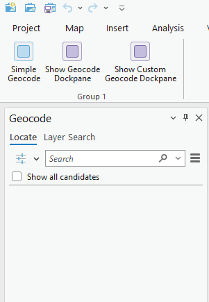
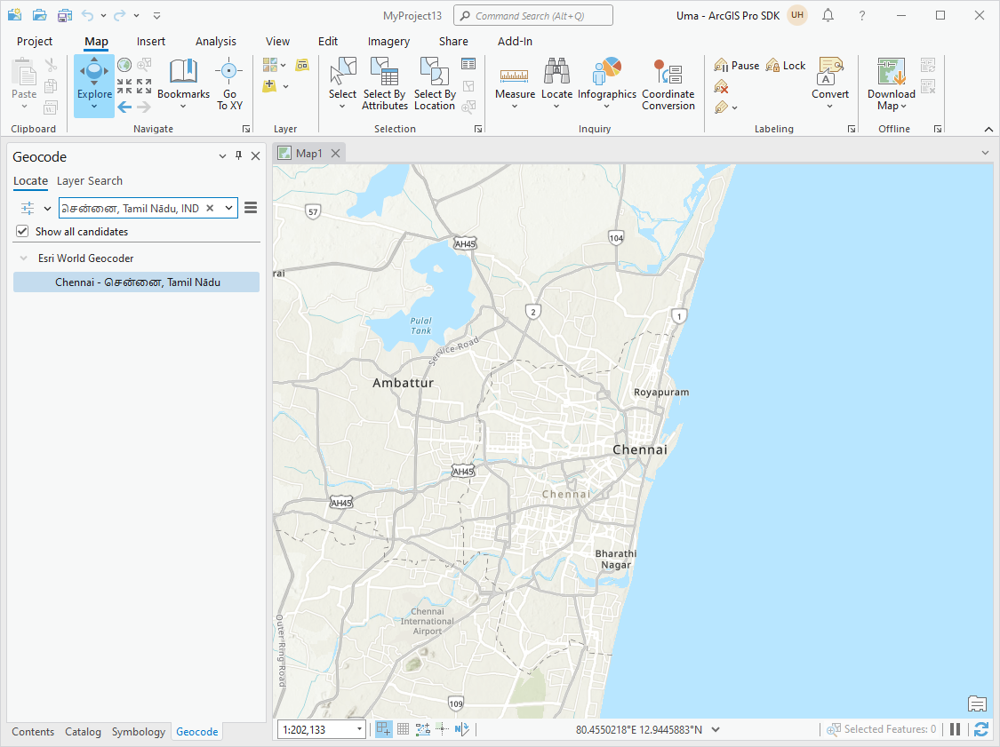
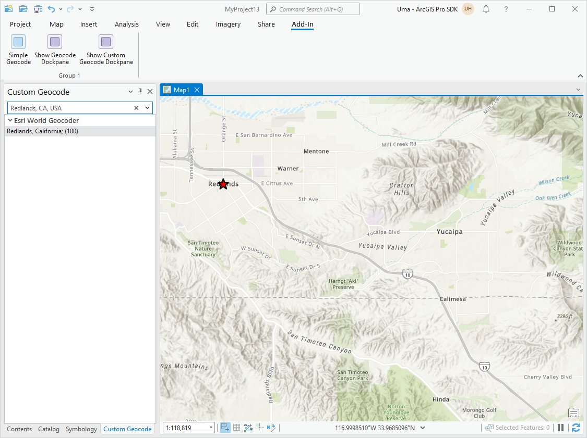

## GeocodingTools

<!-- TODO: Write a brief abstract explaining this sample -->
This sample demonstrates adding geocoding functionalities to your application.  3 different methods of geocoding are presented.  
- simple geocoding using an API method and no custom UI  
- using the LocatorControl on a dockpane  
- more advanced geocoding using API methods with a custom UI providing search capabilities and viewing of results.   

  
The LocatorControl provides similar functionality to that of the Locate dockpane.   
The geocoding API methods allow you tighter control over how to display geocoding results within a UI and on the map.   
You can also use methods within the ArcGIS.Desktop.Mapping.Geocoding.LocatorManager to add, remove, enable, reorder geocoding locators.   
  


<a href="https://pro.arcgis.com/en/pro-app/sdk/" target="_blank">View it live</a>

<!-- TODO: Fill this section below with metadata about this sample-->
```
Language:              C#
Subject:               Map Authoring
Contributor:           ArcGIS Pro SDK Team <arcgisprosdk@esri.com>
Organization:          Esri, https://www.esri.com
Date:                  02/22/2023
ArcGIS Pro:            3.1
Visual Studio:         2022
.NET Target Framework: net6.0-windows
```

## Resources

[Community Sample Resources](https://github.com/Esri/arcgis-pro-sdk-community-samples#resources)

### Samples Data

* Sample data for ArcGIS Pro SDK Community Samples can be downloaded from the [Releases](https://github.com/Esri/arcgis-pro-sdk-community-samples/releases) page.  

## How to use the sample
<!-- TODO: Explain how this sample can be used. To use images in this section, create the image file in your sample project's screenshots folder. Use relative url to link to this image using this syntax:  -->
1. In Visual Studio click the Build menu. Then select Build Solution.  
1. Launch the debugger to open ArcGIS Pro.  
1. Open any project.  
1. Click on the Add-In Tab.  
1. Click on the *Simple Geocode* button.   
1. A Messagebox will be displayed with the geocode results.   
    
    
  
1. Click on the *Show Geocode Dockpane* button.   
1. The Geocode dock pane will open up.  Enter a location and see the results display in the dockpane as well as on the map.  
    
    
  
1. Click on the *Show Custom Geocode Dockpane* button.   
1. The Custom Geocode dock pane will open up.    
1. Enter a location and see the results display in the dockpane.  
1. Highlight a result and see the map zoom and a symbol be added to the map at the result location.   
    
  


<!-- End -->

&nbsp;&nbsp;&nbsp;&nbsp;&nbsp;&nbsp;
&nbsp;&nbsp;&nbsp;&nbsp;&nbsp;&nbsp;&nbsp;&nbsp;&nbsp;&nbsp;&nbsp;&nbsp;
[Home](https://github.com/Esri/arcgis-pro-sdk/wiki) | <a href="https://pro.arcgis.com/en/pro-app/latest/sdk/api-reference" target="_blank">API Reference</a> | [Requirements](https://github.com/Esri/arcgis-pro-sdk/wiki#requirements) | [Download](https://github.com/Esri/arcgis-pro-sdk/wiki#installing-arcgis-pro-sdk-for-net) | <a href="https://github.com/esri/arcgis-pro-sdk-community-samples" target="_blank">Samples</a>
