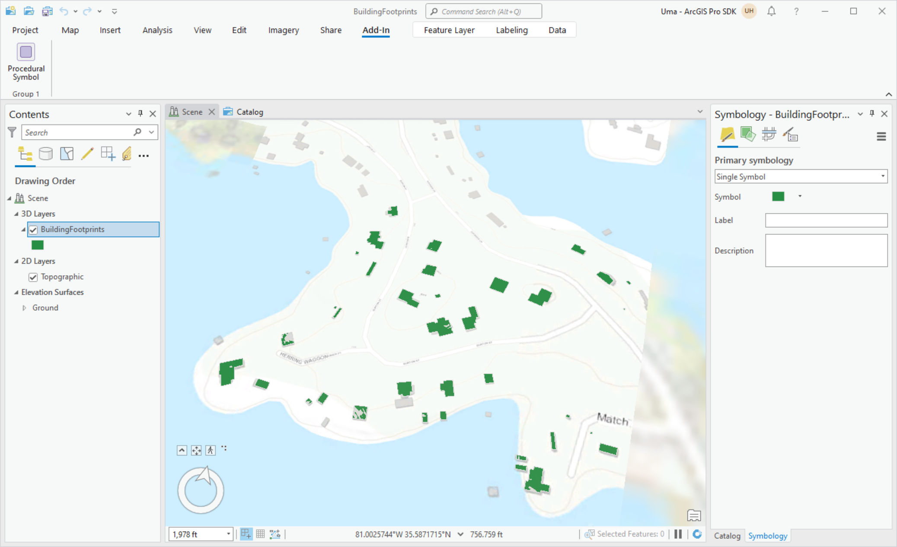

## ProceduralSymbolLayersWithRulePackages

<!-- TODO: Write a brief abstract explaining this sample -->
This sample demonstrates rendering a polygon feature layer with a City Engine rule package. The procedural symbol layer that is created is then saved as an item in a personal style in the project.  
  


<a href="https://pro.arcgis.com/en/pro-app/sdk/" target="_blank">View it live</a>

<!-- TODO: Fill this section below with metadata about this sample-->
```
Language:              C#
Subject:               Map-Authoring
Contributor:           ArcGIS Pro SDK Team <arcgisprosdk@esri.com>
Organization:          Esri, https://www.esri.com
Date:                  06/10/2022
ArcGIS Pro:            3.0
Visual Studio:         2022
.NET Target Framework: net6.0-windows
```

## Resources

[Community Sample Resources](https://github.com/Esri/arcgis-pro-sdk-community-samples#resources)

### Samples Data

* Sample data for ArcGIS Pro SDK Community Samples can be downloaded from the [Releases](https://github.com/Esri/arcgis-pro-sdk-community-samples/releases) page.  

## How to use the sample
<!-- TODO: Explain how this sample can be used. To use images in this section, create the image file in your sample project's screenshots folder. Use relative url to link to this image using this syntax:  -->
1. Download the Community Sample data (see under the 'Resources' section for downloading sample data).  The sample data contains a project package called 'ArcGISProSampleBuildings.ppkx' which is required for this sample.  Make sure that the Sample data is unzipped in c:\data and "C:\Data\RulePackages" is available.  
1. Open this solution in Visual Studio.    
1. Click the build menu and select Build Solution.  
1. Launch the debugger to open ArCGIS Pro.    
1. Open the project package "ArcGISProSampleBuildings.ppkx" located in the "C:\Data\RulePackages" folder since this project contains all required data.  
  
  
1. Click the ADD-IN tab in ArcGIS Pro.  
1. Click the Procedural Symbol button. This will open the ProceduralSymbol dockpane.  
1. There are 3 City Engine rule packages available in this dockpane. Select any rule package thumbnail in the gallery.  
  
  
1. The building footprint feature layer will be rendered with this rule package.    
  
  
1. In your project, a BuildingStyles Style project item will be created. This will contain the procedural symbol used to render the feature layer.  
Note: In the TOC, you will notice that the Building Footprint layer will not have a thumbnail for the generated symbol.   
You can fix this by using the Symbology Dockpane and clicking the camera button to create a Thumbnail. Click Apply to apply the image to the TOC.  
  


<!-- End -->

&nbsp;&nbsp;&nbsp;&nbsp;&nbsp;&nbsp;
&nbsp;&nbsp;&nbsp;&nbsp;&nbsp;&nbsp;&nbsp;&nbsp;&nbsp;&nbsp;&nbsp;&nbsp;
[Home](https://github.com/Esri/arcgis-pro-sdk/wiki) | <a href="https://pro.arcgis.com/en/pro-app/latest/sdk/api-reference" target="_blank">API Reference</a> | [Requirements](https://github.com/Esri/arcgis-pro-sdk/wiki#requirements) | [Download](https://github.com/Esri/arcgis-pro-sdk/wiki#installing-arcgis-pro-sdk-for-net) | <a href="https://github.com/esri/arcgis-pro-sdk-community-samples" target="_blank">Samples</a>
