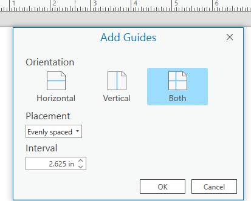
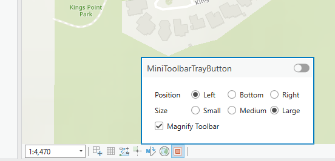

## TrayButtons

<!-- TODO: Write a brief abstract explaining this sample -->
This sample illustrates how to build custom tray buttons.    
Three samples are included.  
The first is a simple map tray button, ZoomToVisibleExtentTrayButton. This tray button will change the map extent to the visible extent of all layers in the map.  
The second sample is the layout tray toggle button.  This tray button is the Toggle button type created to be used in layout only.   
When toggled on and off layout guides that have been authored in the current layout will change from being visible to invisible or vice versa depending on the toggle state of the tray button.  
The third sample is a map tray popup button. This tray button toggles the editing mini toolbar visibility and re-creates on the popup, UI from the Editing backstage options controlling the mini toolbar.  
  


<a href="https://pro.arcgis.com/en/pro-app/sdk/" target="_blank">View it live</a>

<!-- TODO: Fill this section below with metadata about this sample-->
```
Language:              C#
Subject:               Map Authoring
Contributor:           ArcGIS Pro SDK Team <arcgisprosdk@esri.com>
Organization:          Esri, https://www.esri.com
Date:                  02/22/2023
ArcGIS Pro:            3.1
Visual Studio:         2022
.NET Target Framework: net6.0-windows
```

## Resources

[Community Sample Resources](https://github.com/Esri/arcgis-pro-sdk-community-samples#resources)

### Samples Data

* Sample data for ArcGIS Pro SDK Community Samples can be downloaded from the [Releases](https://github.com/Esri/arcgis-pro-sdk-community-samples/releases) page.  

## How to use the sample
<!-- TODO: Explain how this sample can be used. To use images in this section, create the image file in your sample project's screenshots folder. Use relative url to link to this image using this syntax:  -->
1. In Visual Studio click the Build menu.Then select Build Solution.  
1. Launch the debugger to open ArcGIS Pro.  
1. ArcGIS Pro will open, select a project that has editable layers in the map.   
1. Change the map extent and test out the tray button with the zoom to extent icon and see that the map extent will update to the extent off all visible layers.   
1. Open a layout, or insert a new layout and add a map frame to the layout.      
1. Right click on the ruler and select 'Add Guides..' In the dialog select Orientation 'Both' and Placement 'Evenly spaced' and click OK.  
   
  
1. Click on the tray toggle button 'LayoutGuideToggle', which had the ruler icon and is directly to the right of the snapping tray button in the bottom left of the map.   
       
  
1. The first click turns on the Guides, so click a second time to toggle them off, a third click will toggle them back on.   
1. Activate the map view again and open the Create Features dialog and select a template to start sketching. The editing mini toolbar will appear on the map.   
1. Hover over the red square tray button icon, which is the Mini Toolbar Tray Button defined in this sample.   
      
  
1. Click on a radio button to change the position and size of the mini toolbar and check Magnify. Notice the toolbar is updated to match the new properties.  
1. Toggle the tray button and notice the mini toolbar is no longer visible.       
1. Revert any properties change to the mini toobar if not desired.   
  


<!-- End -->

&nbsp;&nbsp;&nbsp;&nbsp;&nbsp;&nbsp;
&nbsp;&nbsp;&nbsp;&nbsp;&nbsp;&nbsp;&nbsp;&nbsp;&nbsp;&nbsp;&nbsp;&nbsp;
[Home](https://github.com/Esri/arcgis-pro-sdk/wiki) | <a href="https://pro.arcgis.com/en/pro-app/latest/sdk/api-reference" target="_blank">API Reference</a> | [Requirements](https://github.com/Esri/arcgis-pro-sdk/wiki#requirements) | [Download](https://github.com/Esri/arcgis-pro-sdk/wiki#installing-arcgis-pro-sdk-for-net) | <a href="https://github.com/esri/arcgis-pro-sdk-community-samples" target="_blank">Samples</a>
