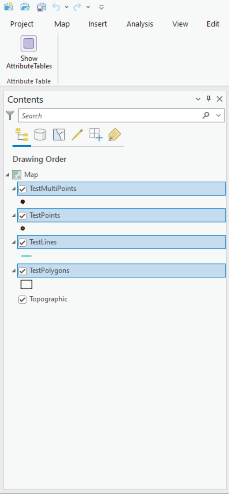
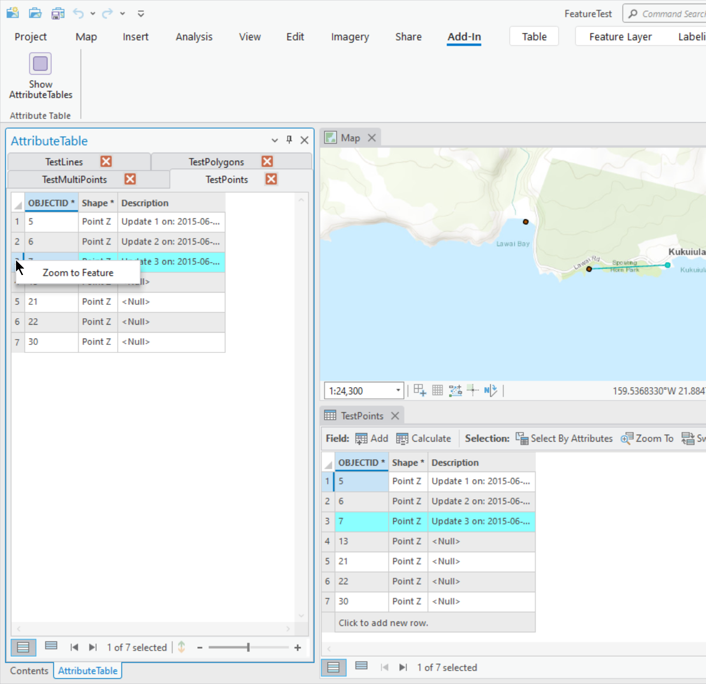
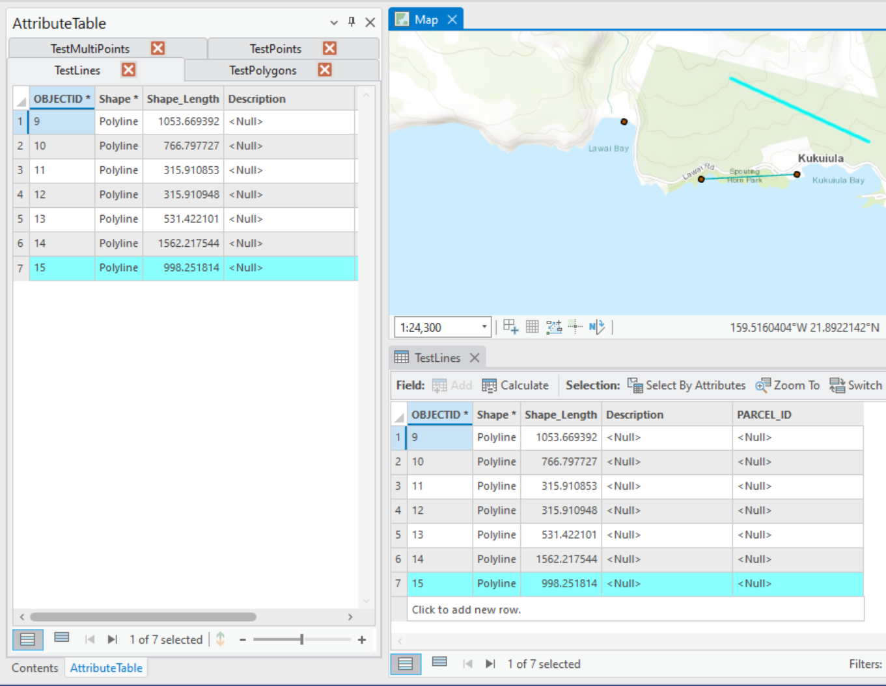

## TableControlsDockpane

<!-- TODO: Write a brief abstract explaining this sample -->
This sample demonstrates using multiple TableControls on a dockpane.   
The example shows multiple table controls selectable by a tab control.  A TableControl is filled with content from selected items on the map's Contents TOC dockpane.   
A context menu is added to each table control allowing access to row functionality in the table control.   
  


<a href="https://pro.arcgis.com/en/pro-app/sdk/" target="_blank">View it live</a>

<!-- TODO: Fill this section below with metadata about this sample-->
```
Language:              C#
Subject:               Map Exploration
Contributor:           ArcGIS Pro SDK Team <arcgisprosdk@esri.com>
Organization:          Esri, https://www.esri.com
Date:                  02/22/2023
ArcGIS Pro:            3.1
Visual Studio:         2022
.NET Target Framework: net6.0-windows
```

## Resources

[Community Sample Resources](https://github.com/Esri/arcgis-pro-sdk-community-samples#resources)

### Samples Data

* Sample data for ArcGIS Pro SDK Community Samples can be downloaded from the [Releases](https://github.com/Esri/arcgis-pro-sdk-community-samples/releases) page.  

## How to use the sample
<!-- TODO: Explain how this sample can be used. To use images in this section, create the image file in your sample project's screenshots folder. Use relative url to link to this image using this syntax:  -->
1. Download the Community Sample data (see under the 'Resources' section for downloading sample data)  
1. Make sure that the Sample data is unzipped in c:\data   
1. The project used for this sample is 'C:\Data\FeatureTest\FeatureTest.aprx'  
1. In Visual Studio click the Build menu. Then select Build Solution.  
1. Launch the debugger to open ArcGIS Pro.  
1. Select the FeatureTest.aprx project  
1. Open the current active map's Contents dockpane and select the layers for which to view the attribute tables:  
  
  
1. Click on the ADD-IN tab and the click the 'Show AttributeTables' button.  
1. For each selected layer on the Content TOC a tab and the corresponding TableControl is added on the Attribute table viewer dockpane:  
  
  
1. Click any row in one of those tables then right click and select 'zoom to feature' from the context menu.  
1. The map will zoom to the selected feature.  
  
  
1. Select the 'Edit' tab on the ArcGIS Pro ribbon and 'Create' new features  
1. On the 'Create Features' pane select the 'TestLines' feature layer and create a new line feature on the map.  
1. Note that the table control on the Attribute Table Viewer dockpane is automatically updated to show the newly added feature.  
  
  


<!-- End -->

&nbsp;&nbsp;&nbsp;&nbsp;&nbsp;&nbsp;
&nbsp;&nbsp;&nbsp;&nbsp;&nbsp;&nbsp;&nbsp;&nbsp;&nbsp;&nbsp;&nbsp;&nbsp;
[Home](https://github.com/Esri/arcgis-pro-sdk/wiki) | <a href="https://pro.arcgis.com/en/pro-app/latest/sdk/api-reference" target="_blank">API Reference</a> | [Requirements](https://github.com/Esri/arcgis-pro-sdk/wiki#requirements) | [Download](https://github.com/Esri/arcgis-pro-sdk/wiki#installing-arcgis-pro-sdk-for-net) | <a href="https://github.com/esri/arcgis-pro-sdk-community-samples" target="_blank">Samples</a>
