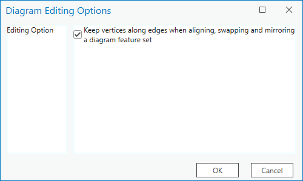
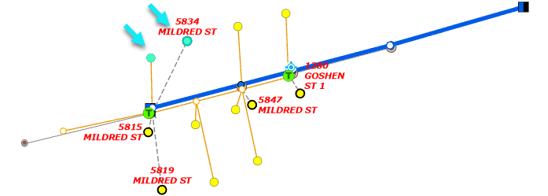
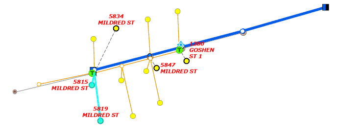
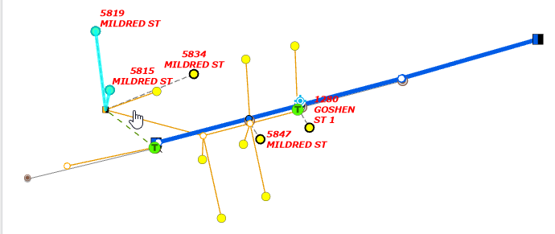
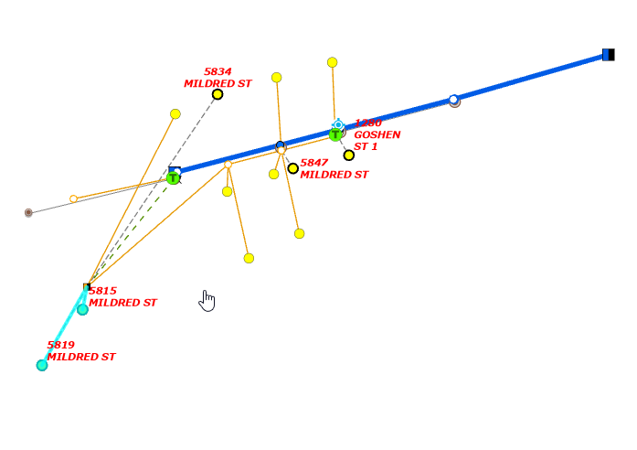
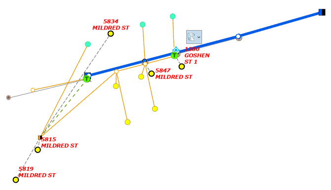
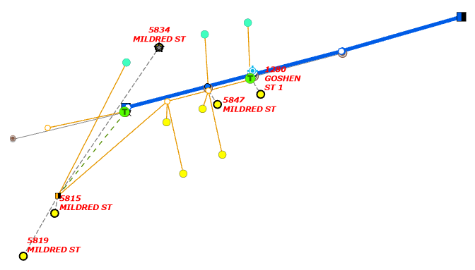
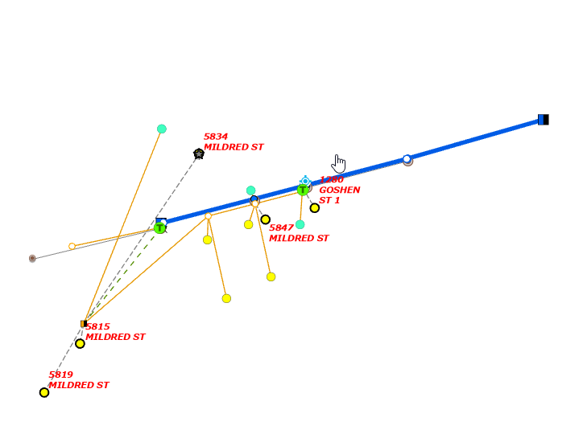

## DiagramEditing

<!-- TODO: Write a brief abstract explaining this sample -->
This add-in demonstrates how to develop some helpful custom diagram editing commands to swap two diagram features, mirror a set of diagram features, and align diagram junctions.  
These custom commands are available on the Add-In tab in the Diagram Editing group:  
  
NOTE: The CustomDiagramEditingTools add-in code is a generic code sample that applies to any network diagram related to any utility or trace network dataset.This add-in demonstrates how to develop some helpful custom diagram editing commands to swap two diagram features, mirror a set of diagram features, and align diagram junctions.  
These custom commands are available on the Add-In tab in the Diagram Editing group:  
  
NOTE: The CustomDiagramEditingTools add-in code is a generic code sample that applies to any network diagram related to any utility or trace network dataset.  
  


<a href="https://pro.arcgis.com/en/pro-app/sdk/" target="_blank">View it live</a>

<!-- TODO: Fill this section below with metadata about this sample-->
```
Language:              C#
Subject:               NetworkDiagram
Contributor:           ArcGIS Pro SDK Team <arcgisprosdk@esri.com>
Organization:          Esri, https://www.esri.com
Date:                  02/22/2023
ArcGIS Pro:            3.1
Visual Studio:         2022
.NET Target Framework: net6.0-windows
```

## Resources

[Community Sample Resources](https://github.com/Esri/arcgis-pro-sdk-community-samples#resources)

### Samples Data

* Sample data for ArcGIS Pro SDK Community Samples can be downloaded from the [Releases](https://github.com/Esri/arcgis-pro-sdk-community-samples/releases) page.  

## How to use the sample
<!-- TODO: Explain how this sample can be used. To use images in this section, create the image file in your sample project's screenshots folder. Use relative url to link to this image using this syntax:  -->
Using the sample:    
  
1. In Visual Studio click the Build menu. Then select Build Solution.    
1. Start ArcGIS Pro.    
1. Open your favorite utility network or trace network ArcGIS Pro project.  
1. Open the network diagram you want to edit or create a new network diagram.  
1. Click the Add-In tab on the ribbon.  
When there is no diagram features currently selected in the diagram map, most of the commands in the Diagram Editing group are disabled:  
  
The following sections detail how to use each custom diagram editing command installed with this add-in.  
--- Set the custom diagram editing tool options ---  
  
1. On the Add-In tab, in the Diagram Editing group, click the Diagram Editing Options dialog box launcher.  
  
  
1. If you want these custom editing commands to consider the vertices along any processed diagram edges, make sure the 'Keep vertices along edges when aligning, swapping and mirroring a diagram feature set' box is checked. This is the default.  
1. If you don't care about the vertices along the processed diagram edges, uncheck the 'Keep vertices along edges when aligning, swapping and mirroring a diagram feature set' box; all vertices along those diagram edges will be removed.  
--- Swap the positions of two diagram features ---  
  
1. In the active diagram map, select the two diagram features you want to swap.  
  
  
1. Click Swap.  
RESULT: The two diagram features are swapped. Any diagram edges related to the swapped diagram features are properly reconnected. Any diagram container or content diagram features related to the swapped diagram features are properly redrawn or repositioned.  
  
NOTE: When the 'Keep vertices along edges when aligning, swapping and mirroring a diagram feature set' option is checked, the Swap command keeps any vertices along any diagram edges connecting the swapped junctions. When the option is unchecked, all vertices along these connected edges are removed. You get an error message when applying the command while there are more than two diagram features selected in the diagram map.  
--- Mirror a diagram feature set ---  
  
1. Select the set of diagram features you want to mirror.  
  
  
1. On the Add-In tab, in the Diagram Editing group, click the drop down arrow under Mirror and click Horizontally Mirror.  
1. Click the diagram background at the location you want.  
RESULT: The Y coordinate of the clicked location is used to determine the horizontal axis along which the reflection operates. The selected diagram junctions are moved to their reflected positions at the opposite side of this horizontal axis.  
  
  
1. On the Add-In tab, in the Diagram Editing group, click the drop down arrow under Mirror and click Vertically Mirror.  
1. Click the diagram background at the location you want.  
RESULT: The X coordinate of the clicked location is used to determine the vertical axis along which the reflection operates. The selected diagram junctions are moved to their reflected positions at the opposite side of this vertical axis.  
  
  
1. On the Add-In tab, in the Diagram Editing group, click the drop down arrow under Mirror and click Angle Mirror.  
1. Sketch a line on the diagram background by clicking the origin location of that line, then clicking its end location.  
  
RESULT: The sketched line is the axis along which the reflection operates. The selected diagram junctions are moved so they are placed at the opposite side of this line.  
  
NOTE: When the 'Keep vertices along edges when aligning, swapping and mirroring a diagram feature set' option is checked, those three Mirror commands process any vertices along the selected diagram edges in the same way they process diagram junctions. When the option is unchecked, these diagram edges display as straight lines joining their two connected diagram junctions.  
--- Align a set of diagram junctions ---  
  
1. Select one or several diagram junctions in the active diagram map.  
  
  
1. On the Add-In tab, in the Diagram Editing group, click the Set Reference Point tool and click the diagram junction you want to be considered as the reference point for the alignment operation.  
RESULT: A gray star overlays the clicked junction when it is correctly set as a reference point  
  
  
1. Click the drop down arrow under Align Junctions and click Vertically Align Junctions or Horizontally Align Junctions.  
RESULT: The selected junctions move so they are vertically/horizontally aligned with the specified reference point.  
  
  
1. Click the drop down arrow under Align Junctions by Angle, then click Vertically Align Junctions by Angle or Horizontally Align Junctions by Angle.  
1. Sketch a line on the diagram background by clicking the origin location of that line, then clicking its end location.  
  
RESULT: The selected junctions move so they are vertically/horizontally projected along the line that goes through the specified reference point and is paralleled to the line you’ve just sketched.  
  
NOTE: When the 'Keep vertices along edges when aligning, swapping and mirroring a diagram feature set' option is checked, these four alignment commands keep any vertices along any diagram edges connecting the aligned junctions. When the option is unchecked, all vertices along these connected edges are removed. To set another diagram junction as the reference point, click the diagram junction.The gray star over the previous reference point is removed, and a new gray star overlays the newly clicked diagram junction. This junction is considered as the new reference point in the diagram.  
To remove the specified reference point, click anywhere on the diagram background. The gray star over the current reference point is removed.  
  


<!-- End -->

&nbsp;&nbsp;&nbsp;&nbsp;&nbsp;&nbsp;
&nbsp;&nbsp;&nbsp;&nbsp;&nbsp;&nbsp;&nbsp;&nbsp;&nbsp;&nbsp;&nbsp;&nbsp;
[Home](https://github.com/Esri/arcgis-pro-sdk/wiki) | <a href="https://pro.arcgis.com/en/pro-app/latest/sdk/api-reference" target="_blank">API Reference</a> | [Requirements](https://github.com/Esri/arcgis-pro-sdk/wiki#requirements) | [Download](https://github.com/Esri/arcgis-pro-sdk/wiki#installing-arcgis-pro-sdk-for-net) | <a href="https://github.com/esri/arcgis-pro-sdk-community-samples" target="_blank">Samples</a>
