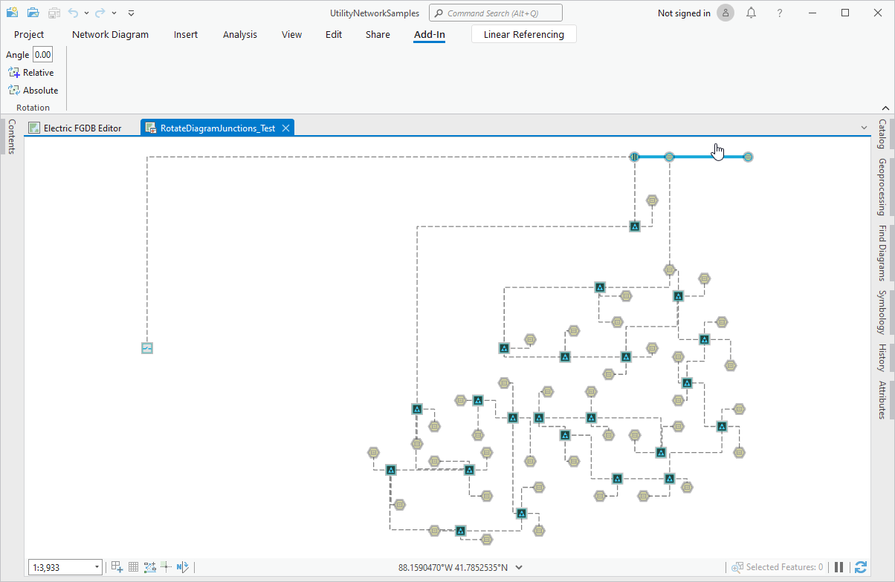
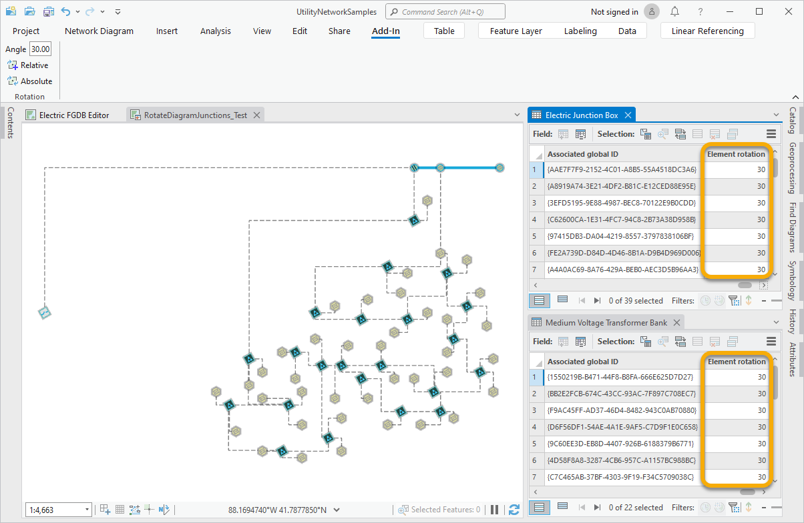
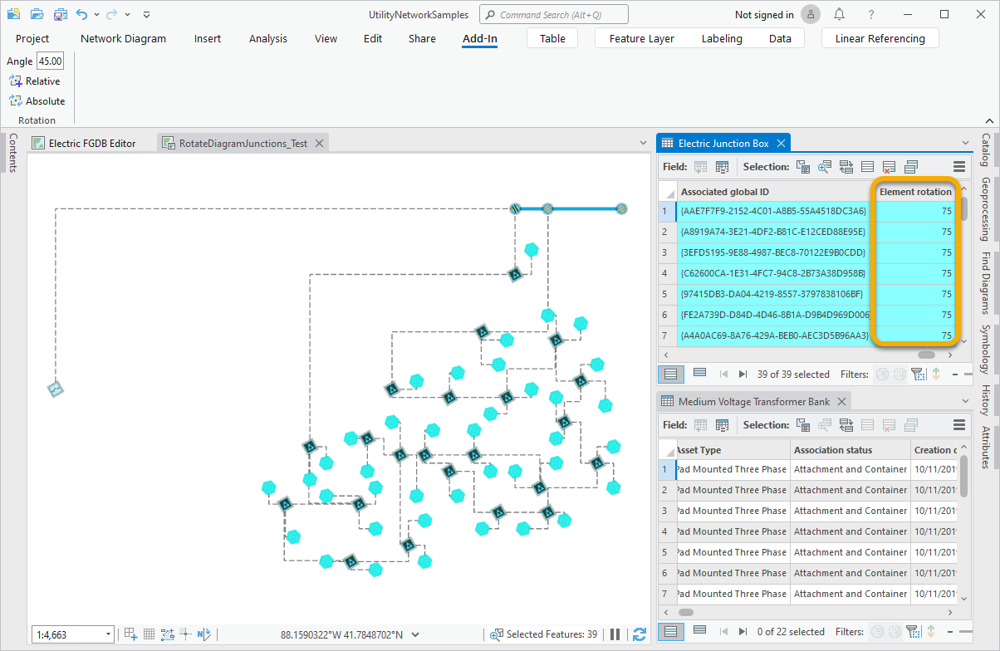
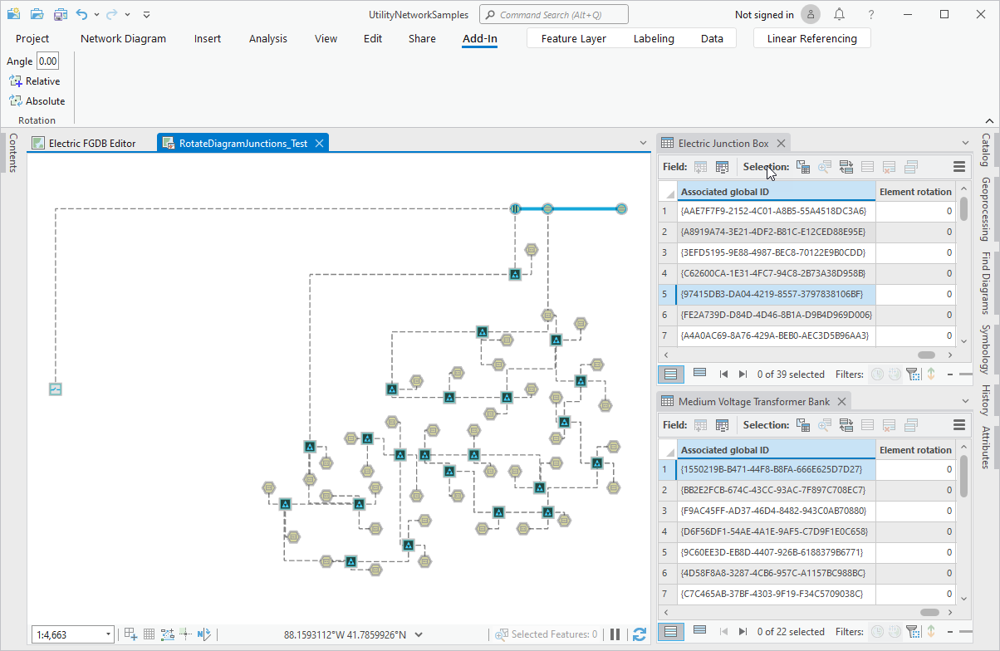

## EditDiagramJunctionRotation

<!-- TODO: Write a brief abstract explaining this sample -->
This add-in demonstrates the programmatic rotation of Junctions in a Network Diagram.  
Attributes cannot be manually edited from network diagrams; nor the attributes stored in the diagram feature classes, nor those coming from the join with the associated network source classes.  
However, there are two attributes on the network diagram side that are editable by code; the diagram feature Shape and diagram junction Rotation attributes. In this add-in sample, you will learn about how to edit the Rotation attribute on the diagram junction class.  
NOTE: The workflow steps detailed below is based on a sample utility network dataset for which the diagram layer definition on the related diagram templates have been set up so the junction symbol rotates according to this Rotation attribute value. The code provided with this add-in sample can apply to any utility network dataset. However, to get the diagram junction symbols being rotated according to the Rotation field value, you must set up the diagram layer definition on your templates.  
To learn more about how to get diagram junction symbols vary by rotation, see https://pro.arcgis.com/en/pro-app/latest/help/data/network-diagrams/refine-the-diagram-layer-definition-on-a-template.htm  
   
Community Sample data (see under the "Resources" section for downloading sample data) has a UtilityNetworkSamples.aprx  project that contains a utility network that can be used with this sample.  This project can be found under the   
C:\Data\UtilityNetwork folder. Alternatively, you can also use any utility network data with this sample, although constant  values may need to be changed.  
  


<a href="https://pro.arcgis.com/en/pro-app/sdk/" target="_blank">View it live</a>

<!-- TODO: Fill this section below with metadata about this sample-->
```
Language:              C#
Subject:               NetworkDiagram
Contributor:           ArcGIS Pro SDK Team <arcgisprosdk@esri.com>
Organization:          Esri, https://www.esri.com
Date:                  06/10/2022
ArcGIS Pro:            3.0
Visual Studio:         2022
.NET Target Framework: net6.0-windows
```

## Resources

[Community Sample Resources](https://github.com/Esri/arcgis-pro-sdk-community-samples#resources)

### Samples Data

* Sample data for ArcGIS Pro SDK Community Samples can be downloaded from the [Releases](https://github.com/Esri/arcgis-pro-sdk-community-samples/releases) page.  

## How to use the sample
<!-- TODO: Explain how this sample can be used. To use images in this section, create the image file in your sample project's screenshots folder. Use relative url to link to this image using this syntax:  -->
1. In Visual Studio click the Build menu.  Then select Build Solution.    
1. Click Start button to open ArcGIS Pro.    
1. ArcGIS Pro will open.    
1. Open C:\Data\UtilityNetwork\UtilityNetworkSamples.aprx  
1. Click on the Map tab on the ribbon. Then, in the Navigate group, expand Bookmarks and click Full Extent.  
1. Click on the Utility Network tab in the ribbon. Then, in the Diagram group, click Find Diagrams.  
1. In the Find Diagrams pane, search for the diagram stored as RotateDiagramJunctions_Test and double click it so it opens  
      
  
1. Click on the Add-in tab on the ribbon    
1. In the Rotation group, type any degree angle value you want in the text box. For example, type 30.  
      
  
1. Then, click on the Relative tool.  
 All the diagram junction symbols rotate by 30 degrees.  
      
  
1. On the Contents pane, right click the Medium Voltage Transformer Bank layer and click Attribute Table.  
1. Right click the Electric Junction Box layer and click Attribute Table.  
1. Have a look to the Element rotation field in the two open attribute tables. Any diagram feature Element rotation is set to 30.  
      
  
1. On the Contents pane, right-click the Electric Junction Box layer and click Selection > Select All.  
1. In the Rotation group, type another degree angle value in the text box. For example, type 45.  
1. Then, click on the Relative tool.  
All the selected Electric Junction Box diagram junction symbols rotate by 45 degrees more.  
  
1. Have a look to the Element rotation field in the Electric Junction Box attribute table. Any Element rotation field in this table is set to 75.  
      
  
1. Have a look to the Element rotation field in the Medium Voltage Transformer Bank attribute table. Any Element rotation field in this table is still set to 30.  
1. Clear the selection in the diagram map.  
1. Click on the Add-in tab on the ribbon    
1. In the Rotation group, type 0 as the degree angle value in the text box.  
1. Then, click on the Absolute tool.  
All the diagram junction symbols in the diagram rotate so they are restored to their initial angles.  
      
  


<!-- End -->

&nbsp;&nbsp;&nbsp;&nbsp;&nbsp;&nbsp;
&nbsp;&nbsp;&nbsp;&nbsp;&nbsp;&nbsp;&nbsp;&nbsp;&nbsp;&nbsp;&nbsp;&nbsp;
[Home](https://github.com/Esri/arcgis-pro-sdk/wiki) | <a href="https://pro.arcgis.com/en/pro-app/latest/sdk/api-reference" target="_blank">API Reference</a> | [Requirements](https://github.com/Esri/arcgis-pro-sdk/wiki#requirements) | [Download](https://github.com/Esri/arcgis-pro-sdk/wiki#installing-arcgis-pro-sdk-for-net) | <a href="https://github.com/esri/arcgis-pro-sdk-community-samples" target="_blank">Samples</a>
