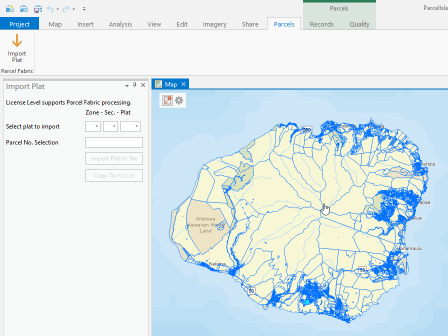
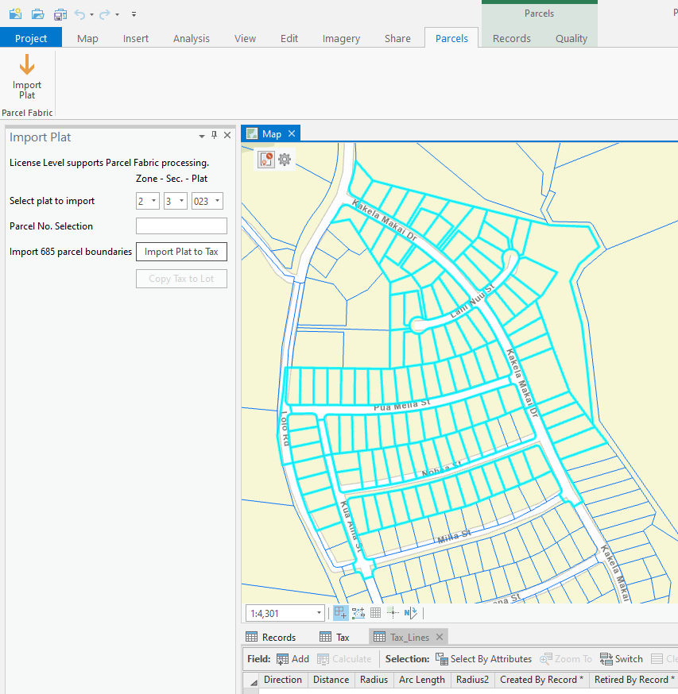

## ImportPlatToFabric

<!-- TODO: Write a brief abstract explaining this sample -->
ParcelFabricAPI shows the following Parcel Fabric API capabilities:  
  
1. Create a Record – a new Record feature in the Records feature class  
1. Setting the created Record as the active record  
1. Copy lines from an existing import feature class selection of non-fabric features into a parcel type called "Tax" in a parcel fabric. Parcel seeds are created automatically.  
1. Build the active record  
1. Copy lines from an existing selection of "Tax" parcels into a parcel type called “Lot” in the same parcel fabric. Parcel seeds are created automatically.  
1. Build the active record  
  


<a href="https://pro.arcgis.com/en/pro-app/sdk/" target="_blank">View it live</a>

<!-- TODO: Fill this section below with metadata about this sample-->
```
Language:              C#
Subject:               Parcel Fabric
Contributor:           ArcGIS Pro SDK Team <arcgisprosdk@esri.com>
Organization:          Esri, https://www.esri.com
Date:                  06/10/2022
ArcGIS Pro:            3.0
Visual Studio:         2022
.NET Target Framework: net6.0-windows
```

## Resources

[Community Sample Resources](https://github.com/Esri/arcgis-pro-sdk-community-samples#resources)

### Samples Data

* Sample data for ArcGIS Pro SDK Community Samples can be downloaded from the [Releases](https://github.com/Esri/arcgis-pro-sdk-community-samples/releases) page.  

## How to use the sample
<!-- TODO: Explain how this sample can be used. To use images in this section, create the image file in your sample project's screenshots folder. Use relative url to link to this image using this syntax:  -->
1. Download the Community Sample data (see under the 'Resources' section for downloading sample data). The sample data contains an ArcGIS Pro project and data to be used for this sample. Make sure that the Sample data is unzipped in c:\data and c:\Data\ParcelFabric is available.  
1. In Visual Studio click the Build menu. Then select Build Solution.  
1. You can run the add-in using the debugger, but to see its full functionality you should run the add-in wihtout the debugger first since some of the functionality like Progress Dialogs are not supported when running ArcGIS Pro from the debugger.  
1. Open the project 'c:\Data\ParcelFabric\Island\ParcelIsland.aprx'.    
1. Select the 'Parcels' tab, and then click on 'Import Plat' to bring up the 'Import Plat' dockpane.  
    
  
1. Use the 'Import Plat' dockpane to select the zone, section, and plat to import:  
    
  
1. Click the 'Import Plat to Tax' button to start the import process.  
    
  
1. After the import completed you can identify some of the Tax records that were created by the import.  
    
  
1. Click the 'Copy Tax to Lot' button in order to copy the imported Tax records into 'Lot' parcels.   
1. After the copy completed you can identify some of the Lot records that were created by the import.  
  
  


<!-- End -->

&nbsp;&nbsp;&nbsp;&nbsp;&nbsp;&nbsp;
&nbsp;&nbsp;&nbsp;&nbsp;&nbsp;&nbsp;&nbsp;&nbsp;&nbsp;&nbsp;&nbsp;&nbsp;
[Home](https://github.com/Esri/arcgis-pro-sdk/wiki) | <a href="https://pro.arcgis.com/en/pro-app/latest/sdk/api-reference" target="_blank">API Reference</a> | [Requirements](https://github.com/Esri/arcgis-pro-sdk/wiki#requirements) | [Download](https://github.com/Esri/arcgis-pro-sdk/wiki#installing-arcgis-pro-sdk-for-net) | <a href="https://github.com/esri/arcgis-pro-sdk-community-samples" target="_blank">Samples</a>
